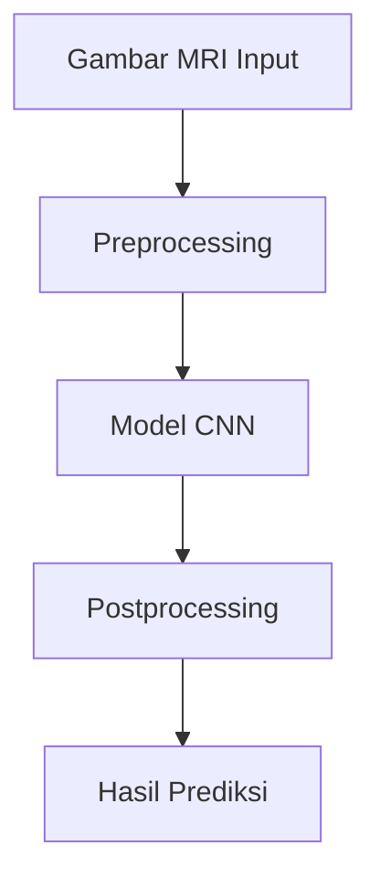
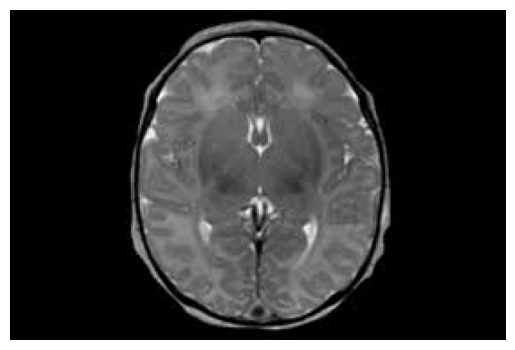

# Proyek Klasifikasi Tumor Otak dengan Convolutional Neural Networks (CNN)

## 📌 Pendahuluan
Proyek ini bertujuan untuk mengembangkan sistem klasifikasi tumor otak menggunakan teknologi pembelajaran mendalam, khususnya arsitektur Convolutional Neural Networks (CNN). Dengan menggunakan dataset gambar MRI otak, sistem ini mampu mengidentifikasi apakah sebuah gambar menunjukkan adanya tumor otak atau tidak.

---

## 🛠️ Teknologi yang Digunakan

1. **Python**:
   Digunakan sebagai bahasa pemrograman utama untuk mengimplementasikan sistem klasifikasi.

2. **TensorFlow dan Keras**:
   Framework deep learning untuk membangun, melatih, dan mengevaluasi model CNN.

3. **OpenCV**:
   Digunakan untuk preprocessing gambar, seperti resizing dan normalisasi.

4. **Numpy dan Matplotlib**:
   - Numpy: Untuk manipulasi array numerik.
   - Matplotlib: Untuk visualisasi hasil pelatihan dan evaluasi model.

---

## 🧩 Arsitektur Model

### Komponen Utama

1. **Preprocessing Input**:
   - Gambar MRI diproses untuk memastikan ukuran konsisten (misalnya, 224x224 piksel).
   - Normalisasi nilai piksel ke rentang [0, 1].

2. **Model CNN**:
   - **Convolutional Layers**:
     Ekstraksi fitur spasial dari gambar input.
   - **Pooling Layers**:
     Reduksi dimensi data untuk mengurangi kompleksitas.
   - **Fully Connected Layers**:
     Pengambilan keputusan berdasarkan fitur yang diekstraksi.
   - **Output Layer**:
     Menghasilkan probabilitas untuk setiap kelas (tumor atau non-tumor).

3. **Postprocessing Output**:
   - Klasifikasi gambar berdasarkan probabilitas tertinggi.
   - Visualisasi hasil prediksi dengan label.

### Diagram Arsitektur


---

## 🧠 Cara Kerja Sistem Klasifikasi

1. **Membaca Input**:
   - Dataset gambar MRI otak diunggah ke sistem.

2. **Preprocessing**:
   - Gambar diresize ke ukuran 224x224 piksel.
   - Normalisasi nilai piksel dilakukan.

3. **Pelatihan Model**:
   - Dataset dibagi menjadi data pelatihan, validasi, dan pengujian.
   - Model CNN dilatih menggunakan data pelatihan.

4. **Evaluasi Model**:
   - Model dievaluasi menggunakan data validasi dan pengujian untuk mengukur akurasi.

5. **Prediksi**:
   - Gambar baru dimasukkan ke model untuk mendapatkan hasil prediksi (tumor/non-tumor).

---

## 🎯 Hasil Prediksi

### Contoh Output
#### Tumor Terdeteksi:


#### Tidak Ada Tumor:


---

## 🚀 Cara Menjalankan Proyek

1. **Instalasi Dependensi**:
   ```bash
   pip install tensorflow opencv-python numpy matplotlib
   ```

2. **Menjalankan Script**:
   Jalankan file utama menggunakan perintah berikut:
   ```bash
   python main.py
   ```

3. **Melihat Hasil**:
   - Hasil prediksi akan ditampilkan di terminal dan disimpan dalam direktori `output`.

---

## 💡 Ide Pengembangan

1. **Peningkatan Akurasi**:
   - Menggunakan arsitektur CNN yang lebih kompleks seperti ResNet atau EfficientNet.

2. **Augmentasi Data**:
   - Meningkatkan ukuran dataset dengan augmentasi seperti rotasi, flipping, dan zooming.

3. **Deteksi Multikategori**:
   - Mengklasifikasikan jenis tumor otak berdasarkan subkategori.

---

## 🏗️ Kontribusi

Kami mengundang kontribusi dari pengembang untuk meningkatkan sistem ini. Anda dapat mengajukan pull request atau melaporkan masalah di repository ini.

---

## 📝 Lisensi
Proyek ini menggunakan lisensi [MIT](LICENSE).

---

Terima kasih telah menggunakan sistem ini! Semoga bermanfaat bagi pengembangan proyek Anda.
